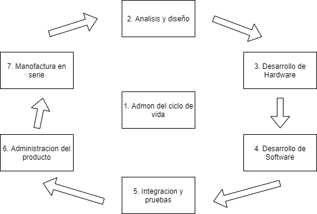

# Sistema embebidos

## :trophy: C0.4 Reto en clase

Investigación sobre los tipos de sistema embebidos y adquisición de datos

___

## Instrucciones

- Realizar una investigación sobre dos tipos de sistemas embebidos y adquisición de datos, respondiendo a las preguntas que se plantean en la sesión de desarrollo.
- Toda actividad o reto se deberá realizar utilizando el estilo **MarkDown con extension .md** y el entorno de desarrollo VSCode, debiendo ser elaborado como un documento **single page**, es decir si el documento cuanta con imágenes, enlaces o cualquier documento externo debe ser accedido desde etiquetas y enlaces.
- Es requisito que el archivo .md contenga una etiqueta del enlace al repositorio de su documento en Github, por ejemplo **Enlace a mi GitHub**
- Al concluir el reto el reto se deberá subir a github el archivo .md creado.
- Desde el archivo **.md** se debe exportar un archivo **.pdf** con la nomenclatura **C0.4_NombreAlumno_Equipo.pdf**, el cual deberá subirse a classroom dentro de su apartado correspondiente, para que sirva como evidencia de su entrega; siendo esta plataforma **oficial** aquí se recibirá la calificación de su actividad por individual.
- Considerando que el archivo .pdf, fue obtenido desde archivo .md, ambos deben ser idénticos y mostrar el mismo contenido.
- Su repositorio ademas de que debe contar con un archivo **readme**.md dentro de su directorio raíz, con la información como datos del estudiante, equipo de trabajo, materia, carrera, datos del asesor, e incluso logotipo o imágenes, debe tener un apartado de contenidos o indice, los cuales realmente son ligas o **enlaces a sus documentos .md**, _evite utilizar texto_ para indicar enlaces internos o externo.
- Se propone una estructura tal como esta indicada abajo, sin embargo puede utilizarse cualquier otra que le apoye para organizar su repositorio.
  
```
| readme.md
| | blog
| | | C0.1_x.md
| | | C0.2_x.md
| | | C0.3_x.md
| | | C0.4_x.md
| | img
| | | x.drawio.png
| | | y.drawio.png
| | docs
| | | A0.1_x.md
| | | A0.2_x.md
```
___

## :pencil2:  Desarrollo

1. Instale la extension Draw.io integration dentro de visual studio code y elabore el diagrama solicitado.
    
2. Apoyado de la información mostrada por el asesor, una investigación, responder a lo siguiente:

#### **Sistema embebido**:

  - **Definición de un sistema embebido:**
  Un sistema embebido ​o empotrado (tambien como integrado, incrustado) es un sistema de computación diseñado para realizar una o algunas pocas funciones dedicadas,​ frecuentemente en un sistema de computación en tiempo real. Al contrario de lo que ocurre con los ordenadores de propósito general (como por ejemplo una computadora personal o PC) que están diseñados para cubrir una amplia gama de necesidades, los sistemas embebidos se diseñan para cubrir necesidades específicas.
  Los sistemas embebidos suelen usar un procesador relativamente pequeño y una memoria pequeña para ello.
  Algunos ejemplos de sistemas embebidos podrían ser dispositivos como un taxímetro, un sistema de control de acceso, la electrónica que controla una máquina expendedora o el sistema de control de una fotocopiadora entre otras múltiples aplicaciones.
  - **Tipo de tecnologías que se pueden involucrar para desarrollar un sistema embebido:**
  La mayoría de los componentes se encuentran incluidos en la placa base (tarjeta de vídeo, audio, módem, etc.) y muchas veces los dispositivos resultantes no tienen el aspecto de lo que se suele asociar a una computadora.
  Los embedidos pueden ser programados en distintos idiomas o lenguajes de programacion y estan muy enlazados con el internet de las cosas o por ejemplo, casas inteligentes debido a su pequeño uso de procesador y su dedicacion a un solo objeto.
  - **Elabore un ilustración que apoye a explicar un mapa de ruta a seguir para crear una arquitectura para un sistema embebido...**

#### **Sistema de adquisición de datos**:

  - **Definición de un sistema de adquisición de datos:**
  La adquisición de datos o adquisición de señales consiste en la toma de muestras del mundo real (sistema analógico) para generar datos que puedan ser manipulados por un ordenador u otros dispositivos electrónicos (sistema digital). Consiste en tomar un conjunto de señales físicas, convertirlas en tensiones eléctricas y digitalizarlas de manera que se puedan ser procesadas por una computadora o PAC.
  Se utiliza en la industria, la investigación científica, el control de máquinas y de producción, la detección de fallas y el control de calidad entre otras aplicaciones.
  - **Tipo de tecnologías que se pueden involucrar para desarrollar un sistema de adquisición de datos:** 
  Se involucra los sensores, este es un dispositivo que convierte una propiedad física o fenómeno en una señal eléctrica correspondiente medible, tal como tensión, corriente, el cambio en los valores de resistencia o condensador, etc. 
  La flexibilidad del procesamiento, posibilidad de realizar las tareas en tiempo real o en análisis posteriores (a fin de analizar los posibles errores), gran capacidad de almacenamiento, facilidad de automatización y utilizacion de estos en distintas areas como es el analisis del tiempo o en algunos objetos dedicados donde mediante sensores necesiten ser monitoreados constantemente.
  - **Elabore un ilustración que apoye a explicar un mapa de ruta a seguir para crear una arquitectura para un sistema de adquisición de datos...**

#### **Caso de éxito**

  - **De acuerdo con el video mostrado, explique que ha permitido la innovación tecnológica a la empresa lograr?**
  Se controla de manera mas optimizada los puntos de la planta o viñedo, con diferentes sensores y con el uso de internet y el internet de la cosas para maximizar las producciones del lugar.
  - **Que tipos de sistemas ha implantado Vodafone al caso de estudio indicado en el video?**
  el IoT el encargado de conectar los objetos de uso normal a internet.

  - **Que tecnologías se observan en este caso de éxito?**
  El uso de los dispositivos IoT asi como tambien acceso a internet, conexiones a las nubes online y accesos y dispositivos a la informacion climatica.

1. Coloque aquí la ilustración elaborada para el **sistema embebido**



- **Macroproceso I.** Administración del ciclo de vida: administra el ciclo completo del sistema embebido desde su concepto hasta la producción en serie del producto.
- **Macroproceso II.** Análisis y diseño: en este proceso se analiza la viabilidad del producto, se obtienen los requerimientos funcionales y no funcionales del sistema.
- **Macroproceso III.** Desarrollo del hardware: se desarrolla la parte electrónica del sistema embebido.
- **Macroproceso IV.** Desarrollo del software: se desarrolla la parte electrónica del sistema embebido.
- **Macroproceso V.** Integración y pruebas: se realiza la integración del sistema, así como pruebas de conformidad y certificación del mismo.
- **Macroproceso VI.** Administración del producto: administra la producción en serie del sistema embebido.

1. Coloque aquí la ilustración elaborada para el **sistema de adquisición de datos**


- Los sistemas de adquisición de señales también conocidos como (DAQ-Data Acquisition), son una pieza clave para el procesamiento de señales analógicas, el diseño de estos sistemas está compuesto por una serie de subsistemas los cuales, en las primeras etapas se encargan de preparar la señal para su discretización, posteriormente un Convertidor Analógico Digital (CAD) convierte esas señales en valores discretos para finalmente ser procesados, comúnmente por un equipo de cómputo. En este trabajo se da un panorama general a considerar para el diseño o elección de un sistema DAQ, ya que es fundamental conocer cada etapa que lo conforma para poder digitalizar apropiadamente una señal proveniente de un fenómeno físico.

___

### :bomb: Rubrica

| Criterios     | Descripción                                                                                  | Puntaje |
| ------------- | -------------------------------------------------------------------------------------------- | ------- |
| Instrucciones | Se cumple con cada uno de los puntos indicados dentro del apartado Instrucciones?            | 20 |
| Desarrollo    | Se respondió a cada uno de los puntos solicitados dentro del desarrollo de la actividad?     | 80      |

   
   
:house: [Ir al inicio de mi repositorio Git](https://github.com/AlexBamaca/AnalisisB)