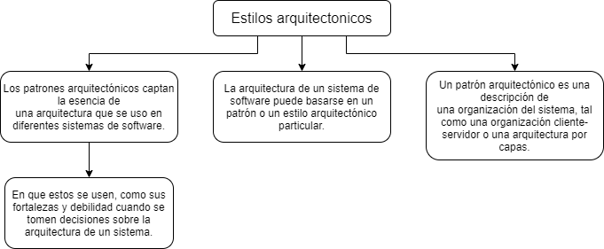
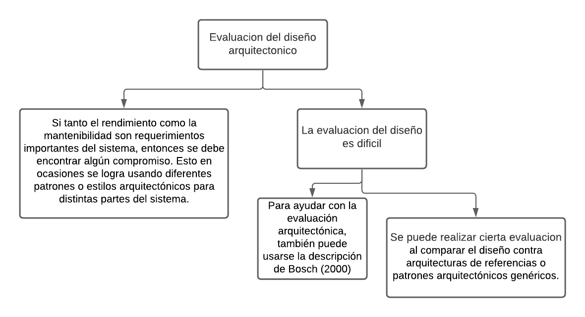
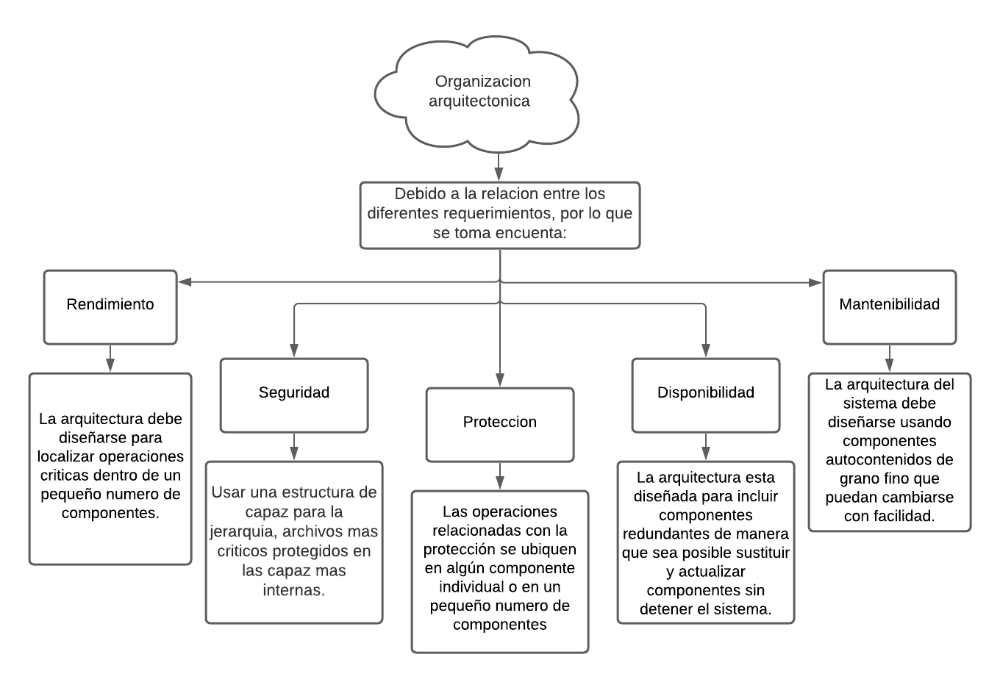

# Diseño arquitectonico

## :trophy: C2.3 Reto en clase

Decisiones en el diseño arquitectónico

### :blue_book: Instrucciones

- De acuerdo con la información presentada por el asesor referente al tema, y basado en el caso de estudio, responder a través de una investigación realizada en Internet las preguntas planteadas durante el desarrollo de esta actividad.
- Toda actividad o reto se deberá realizar utilizando el estilo **MarkDown con extension .md** y el entorno de desarrollo VSCode, debiendo ser elaborado como un documento **single page**, es decir si el documento cuanta con imágenes, enlaces o cualquier documento externo debe ser accedido desde etiquetas y enlaces, y debe ser nombrado con la nomenclatura **C2.x_NombreApellido_Equipo.pdf.**
- Es requisito que el .MD contenga una etiqueta del enlace al repositorio de su documento en GITHUB, por ejemplo **Enlace a mi GitHub** y al concluir el reto se deberá subir a github.
- Desde el archivo **.md** exporte un archivo **.pdf** que deberá subirse a classroom dentro de su apartado correspondiente, sirviendo como evidencia de su entrega, ya que siendo la plataforma **oficial** aquí se recibirá la calificación de su actividad.
- Considerando que el archivo .PDF, el cual fue obtenido desde archivo .MD, ambos deben ser idénticos.
- Su repositorio ademas de que debe contar con un archivo **readme**.md dentro de su directorio raíz, con la información como datos del estudiante, equipo de trabajo, materia, carrera, datos del asesor, e incluso logotipo o imágenes, debe tener un apartado de contenidos o indice, los cuales realmente son ligas o **enlaces a sus documentos .md**, _evite utilizar texto_ para indicar enlaces internos o externo.
- Se propone una estructura tal como esta indicada abajo, sin embargo puede utilizarse cualquier otra que le apoye para organizar su repositorio.

``` 
| readme.md
| | blog
| | | C2.1_x.md
| | | C2.2_x.md
| | | C2.3_x.md
| | img
| | docs
| | | A2.1_x.md
| | | A2.2_x.md
```


## :pencil2: Desarrollo

1. ¿Existe alguna arquitectura de aplicación genérica que actúe como plantilla para el sistema que se está diseñando?
2. ¿Cómo se distribuirá el sistema a través de algunos núcleos o procesadores?
3. ¿Qué patrones o estilos arquitectónicos pueden usarse?
4. ¿Cuál será el enfoque fundamental usado para estructurar el sistema?
5. ¿Cómo los componentes estructurales en el sistema se separarán en sub-componentes?
6. ¿Qué estrategia se usará para controlar la operación de los componentes en el sistema?
7. ¿Cuál organización arquitectónica es mejor para entregar los requerimientos no funcionales del sistema?
8. ¿Cómo se evaluará el diseño arquitectónico?
9. ¿Cómo se documentará la arquitectura del sistema?

- **Diagramas en respuesta de las preguntas anteriores:**








### :bomb: Rubrica

| Criterios     | Descripción                                                                                  | Puntaje |
| ------------- | -------------------------------------------------------------------------------------------- | ------- |
| Instrucciones | Se cumple con cada uno de los puntos indicados dentro del apartado Instrucciones?            | 20 |
| Desarrollo    | Se respondió a cada uno de los puntos solicitados dentro del desarrollo de la actividad?     | 80      |


:house: [Ir al inicio de mi Git](https://github.com/AlexBamaca/AnalisisB)