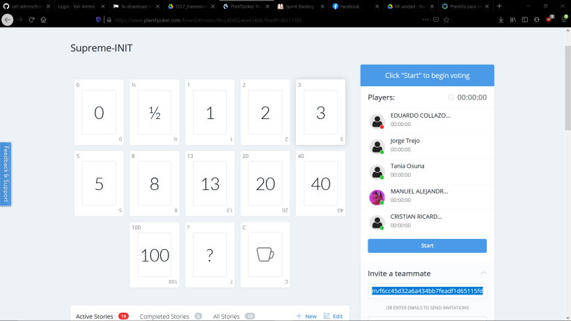
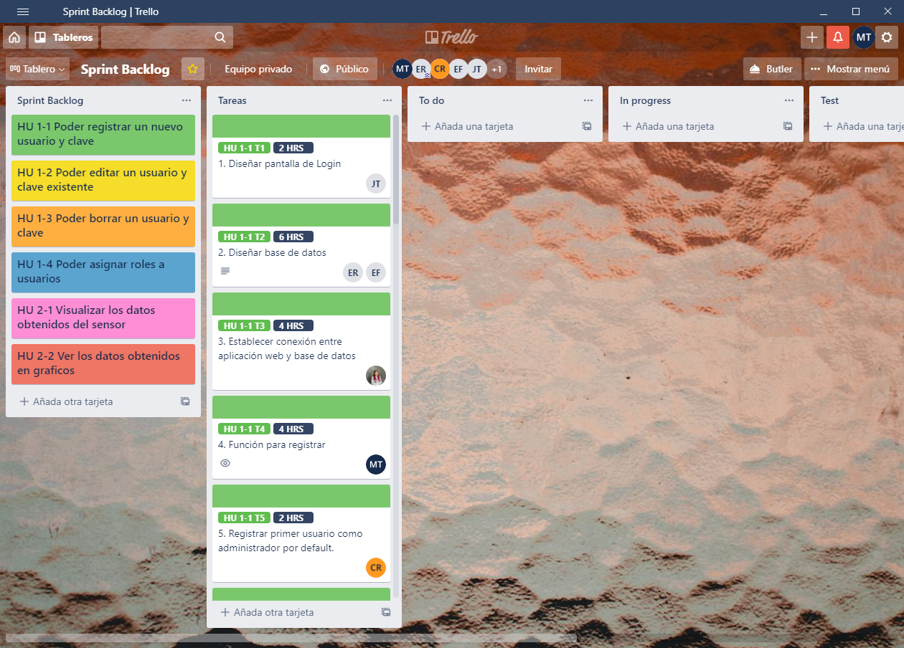
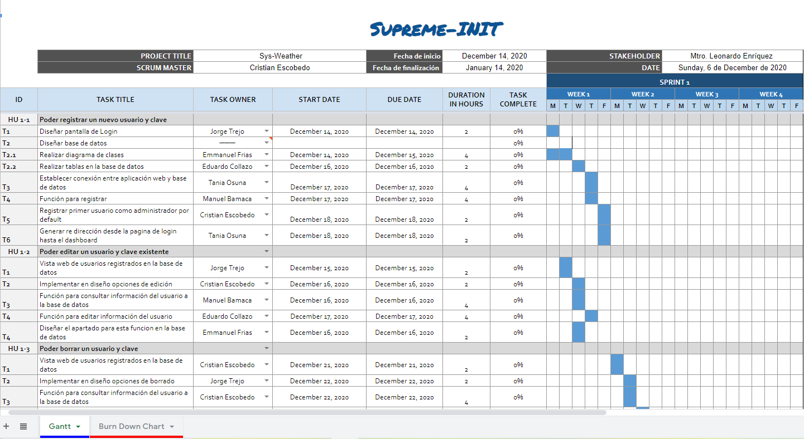
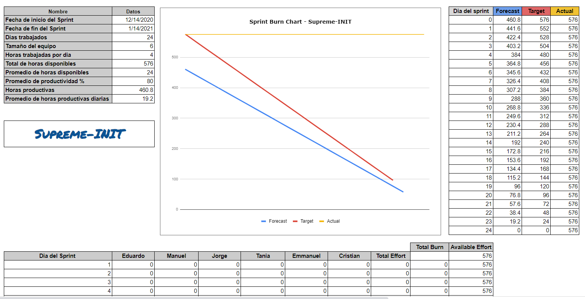
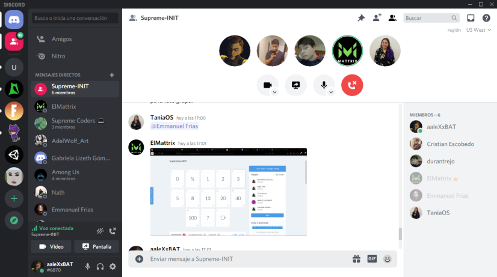

# Introducción

## :trophy: A3.3 Actividad de aprendizaje

Documentación del proyecto utilizando el framework Scrum para la fase planificación y estimación.

### :blue_book: Instrucciones

- Basado en una investigación y en el documento proporcionado por el asesor, realizar la documentación del proyecto utilizando el framework scrum para el caso de estudio.
- Toda actividad o reto se deberá realizar utilizando el estilo **MarkDown con extension .md** y el entorno de desarrollo VSCode, debiendo ser elaborado como un documento **single page**, es decir si el documento cuanta con imágenes, enlaces o cualquier documento externo debe ser accedido desde etiquetas y enlaces, y debe ser nombrado con la nomenclatura **A3.3_NombreApellido_Equipo.pdf.**
- Es requisito que el .MD contenga una etiqueta del enlace al repositorio de su documento en GITHUB, por ejemplo **Enlace a mi GitHub** y al concluir el reto se deberá subir a github.
- Desde el archivo **.md** exporte un archivo **.pdf** que deberá subirse a classroom dentro de su apartado correspondiente, sirviendo como evidencia de su entrega, ya que siendo la plataforma **oficial** aquí se recibirá la calificación de su actividad.
- Considerando que el archivo .PDF, el cual fue obtenido desde archivo .MD, ambos deben ser idénticos.
- Su repositorio ademas de que debe contar con un archivo **readme**.md dentro de su directorio raíz, con la información como datos del estudiante, equipo de trabajo, materia, carrera, datos del asesor, e incluso logotipo o imágenes, debe tener un apartado de contenidos o indice, los cuales realmente son ligas o **enlaces a sus documentos .md**, _evite utilizar texto_ para indicar enlaces internos o externo.
- Se propone una estructura tal como esta indicada abajo, sin embargo puede utilizarse cualquier otra que le apoye para organizar su repositorio.

``` 
| readme.md
| | blog
| | | C3.1_NombredelaActividad.md
| | | C3.2_NombredelaActividad.md
| | | C3.3_NombredelaActividad.md
| | img
| | docs
| | | A3.1_NombredelaActividad.md
| | | A3.2_NombredelaActividad.md
| | | A3.3_NombredelaActividad.md
```


## :pencil2: Desarrollo

1. Intégrese a su equipo de trabajo y comience a preparar lo que a continuación se solicita:
   - [x] **1.1 Identificar las tareas para cada historia de usuario.**
   - [x] **1.2 Estimar las tareas utilizando alguna herramienta digital.**
   La herramienta que se utilizo para estimar las horas fue _PlanIT Poker_.
   
   - [x] **1.3 Cree el Sprint backlog con las tareas estimadas en horas.**
   Las actividades fueron plasmadas en la herramienta de _Trello_, dentro se encuentran las tareas, los identificadores, horas estimadas y los responsables de cada tarea. [Enlace a Trello](https://trello.com/b/zEhZk0wa)
   
   - [x] **1.4 Elabore su diagrama de gantt.**
   Diagrama de Gantt desarrollado en una plantilla de Excel, a traves de Hojas de Calculo de Google. [Enlace al documento.](https://docs.google.com/spreadsheets/d/1_P4xHhEgdN9ypqFAzHFiG5lJ1rg0NUK98SCMfFCq9EE/edit?usp=sharing)
   
   - [x] **1.5 Identifique dependencias de cada tarea y relacionela con la actividad que depende.**
   Las dependencias fueron colocadas como etiqueta en Trello. [Enlace a Trello](https://trello.com/b/zEhZk0wa)
   
   - [x] **1.6 Elabore el Burn down chart del sprint.**
   El Burn Down Chart fue realizado en el mismo documento online de google, se encuentra en una hoja diferente. [Enlace al documento](https://docs.google.com/spreadsheets/d/1_P4xHhEgdN9ypqFAzHFiG5lJ1rg0NUK98SCMfFCq9EE/edit?usp=sharing)
   

2. Presente esta información haciendo uso de herramientas visuales y gráficas dentro de la reunión de planificación del sprint.
3. Coloque en este apartado evidencias que demuestren que se reunieron para desarrollar como equipo la actividad.
   - Evidencias de reunion del equipo:
   
4. Conclusiones. 
   - **Eduardo Collazo Rivera:** "De acuerdo a la actividad la desarrollamos aplicando la metolodgia scrum, que en este caso fue la fase de estimacion y planeacion para identificar cuantas horas se requieren para terminar lo que es el primer sprint del proyecto. Durante esa fase identificamos responsables de tareas y las horas que se requieren para terminar la tarea individualmente, haciendo uso de graficas."
   - **Manuel Bamaca Trujillo:** "En la actividad plasmamos las actividades en un diagrama de Gantt y en un Burn Chart, anteriormente he utilizado estas herramientas pero en equipo la realización y asignación de tareas es mas complejo. La asignación de horas fue desarrollada con una herramienta lo que facilita estos trabajos. A la hora de realizar las actividades se desarrollara por completo estas actividades."
   - **Jorge Durán Trejo:** "La aplicación del framework Scrum en la fase de planificación y estimación fue sumamente útil para definir el tiempo de trabajo que se contempla en el supuesto proyecto y así tener una noción clara del capital y recursos necesarios para llevar a cabo su desarrollo. Dicho framework aporta bastante en lo que a cumplimiento de tiempos respecta."
   - **Emmanuel Frías Aviña:** "Aprender a usar scrum de la manera correcta es una tarea que puede llegar a ser complicado si no se cuenta con los conocimientos adecuados ya que hay que saber como se trabajan sus herramientas y estas pueden llegar a ser complicadas para quien no sepa como implementarlas de la manera correcta."
   - **Cristian Escobedo Ruiz:** "Con el trabajo de scrum se planifico de manera conjunta la distribución de las tareas, estableciendo tiempos y fechas de completado, así mismo se uso el diagrama de Grantt como apoyo para todos los integrantes."
   - **Tania Osuna Simpson:** "En la fase de planificación fueron de suma utilidad los medios audiovisuales de comunicación para establecer una pronta organización de cómo se medirían los tiempos de trabajo. Además, reforzó la mecánica de organización del equipo y se definió un método de trabajo más concreto."

___

#### :bomb: Rubrica

| Criterios     | Descripción                                                                                  | Puntaje |
| ------------- | -------------------------------------------------------------------------------------------- | ------- |
| Instrucciones | Se cumple con cada uno de los puntos indicados dentro del apartado Instrucciones?            | 10      |  | 5 |
| Desarrollo    | Se respondió a cada uno de los puntos solicitados dentro del desarrollo de la actividad?     | 60      |
| Demostración  | El alumno se presenta durante la explicación de la funcionalidad de la actividad?            | 20      |
| Conclusiones  | Se incluye una opinión personal de la actividad  por cada uno de los integrantes del equipo? | 10      |

:house: [Ir al inicio de mi Git](https://github.com/AlexBamaca/AnalisisB)